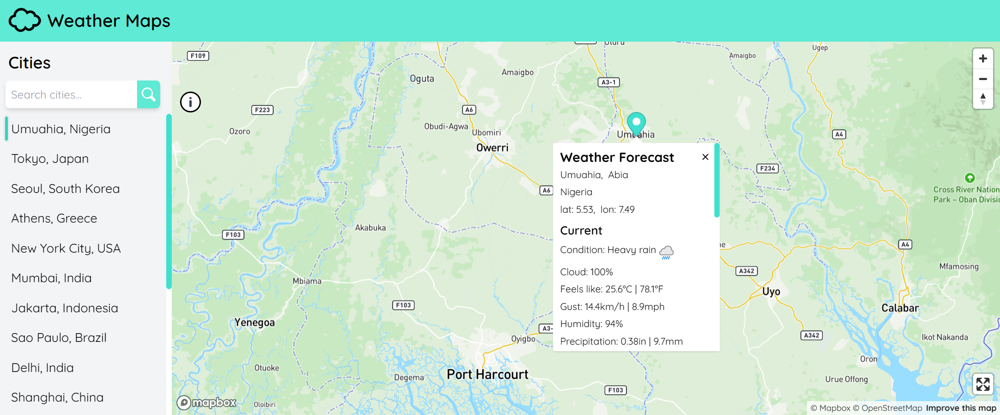

# Map With Weather



A web app which will display a weather for a list of cities on the map.

# ⚡Get Started⚡

- Clone app to local desktop environment
- `npm install` to install all dependencies
- Create a .env file in the root of the project and put your own API keys for Mapbox API and WeatherAPI as follows
  ```
  VITE_MAPBOX_KEY=your mapbox api key
  VITE_WEATHER_API_KEY=your eather api key
  ```
- and lastly `npm run dev` to kickstart the applicatication on local development machine.

# Tech Stack

- React
- TypeScript
- Tailwind

# APIs

- Mapbox
- WeatherAPI

# Features

- View weather data for over 20 selected cities around the world.
- Navigate through the interactive map.
